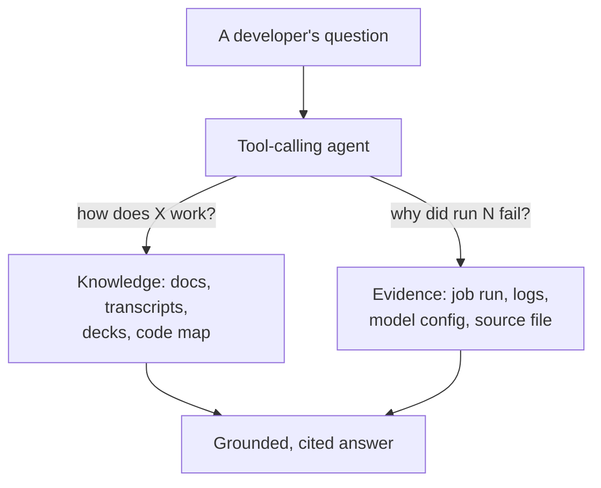
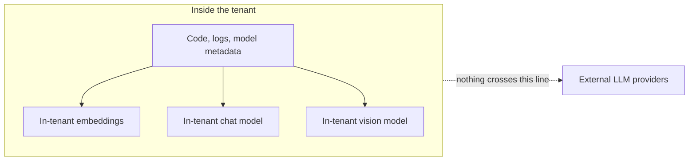
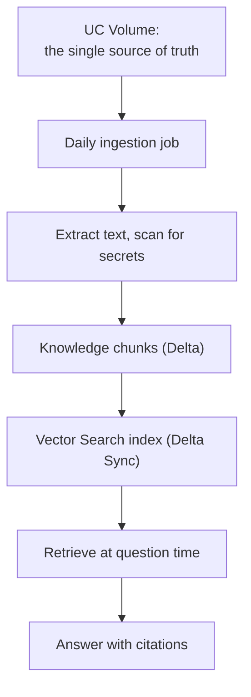
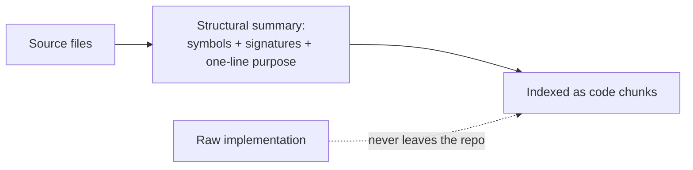
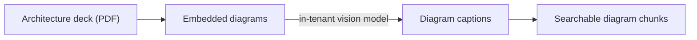
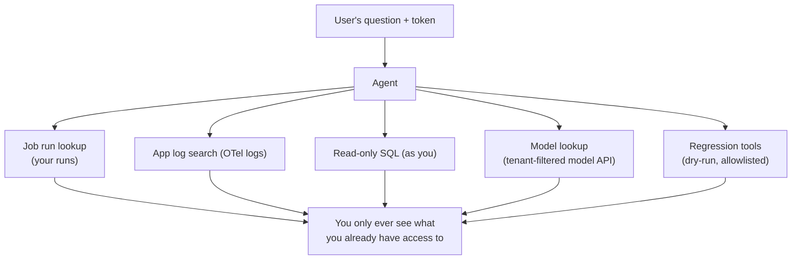
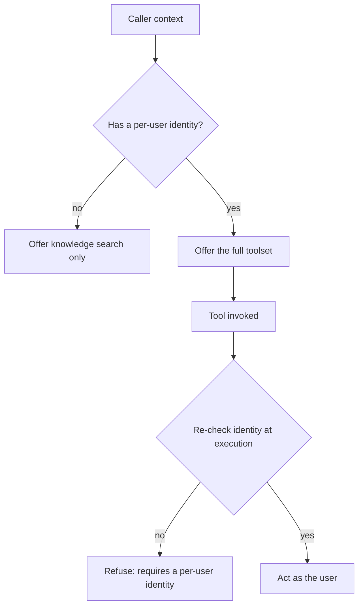
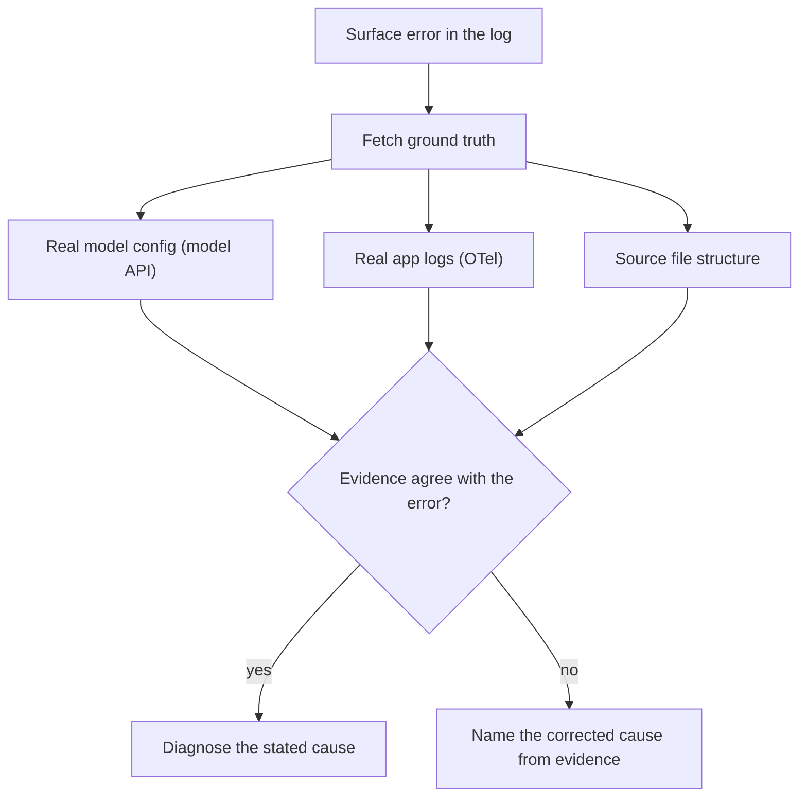
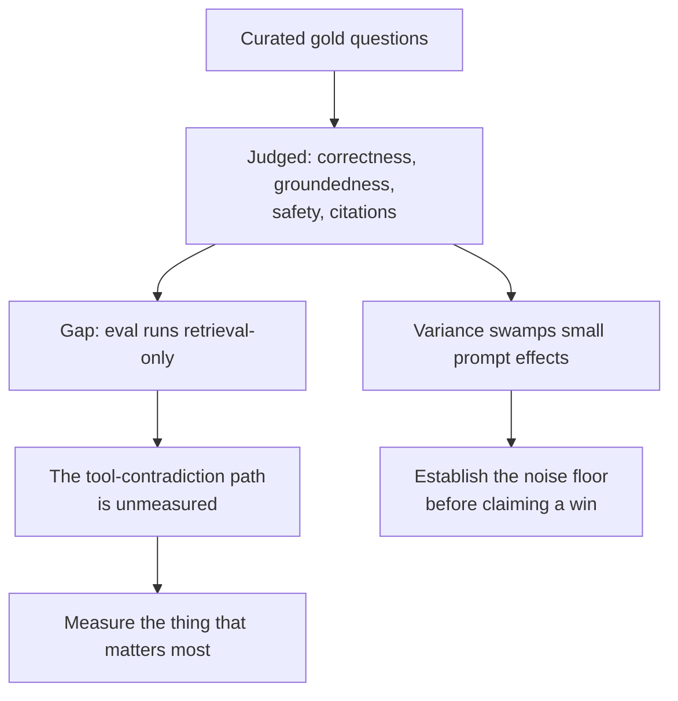
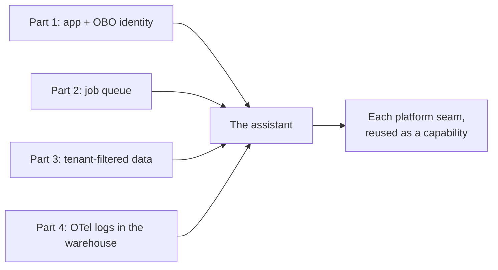

## Why this one is different

The previous four parts had a shape: here is a seam in the platform, here is the confusing
bug it caused, here is what we did about it. This part does not fit that shape, because the
assistant is not a seam we patched, it is a thing we chose to build once the platform
underneath it was solid enough to trust. So the register changes. Less "here is the scar," more
"here is what the scars made possible."

It is also unfinished, and we are going to be honest about that throughout, because an
assistant that diagnoses failures has no business pretending its own story is tidier than it
is. The parts that work, work for concrete reasons. The parts that do not yet, we can point at
precisely, which is its own kind of progress.

## What it actually does

It answers two kinds of question for the people who build and run the platform. The first is
"how does this codebase work," answered with grounded, cited responses drawn from every repo's
docs, the knowledge-transfer transcripts, the architecture decks, and a structural map of every
source file. The second, and the one we care about most, is "why did my job fail," answered not
by restating the error but by checking the real evidence: the actual model config, the app
logs, the source file named in the traceback.

The second question is the one with teeth, because a wrong diagnosis is worse than a hedge. If
someone asks why their run failed and the assistant confidently names the wrong cause, it has
actively made their afternoon worse. That single fact, a wrong "why" is worse than an honest "I
am not sure," drove most of the design decisions below.

## In-tenant only, and why that constraint shaped everything

The hard rule, set before any code, is that nothing leaves the tenant. No code, no logs, no
model metadata, no fragment of a traceback is ever sent to an external model. Embeddings, chat,
reranking, and even the vision model that reads diagrams are all Databricks serving endpoints
inside the same tenant as the data.

That constraint sounds limiting and was actually clarifying. It meant we could never reach for
the easy hosted option, so every capability had to be built from primitives that already lived
in the platform, the same Foundation Model endpoints, Vector Search, and serving infrastructure
the rest of the series leaned on. The assistant is not bolted onto the platform from outside; it
is made of the platform. The privacy rule is what forced that, and the result is a system whose
trust story is simple to state: if the data never leaves, there is no exfiltration path to argue
about.

## Teaching it the codebase without leaking the codebase

Knowledge answers come from retrieval, not from a model that memorized the repos. A daily
ingestion job, running entirely on Databricks, reads a curated set of material, each repo's
top-level docs, the knowledge profiles we wrote by hand, the architecture decks, the transcripts,
chunks it, embeds it, and syncs it into a Vector Search index. At question time the agent
retrieves the relevant chunks and answers from them, with citations, so every claim is traceable
to a source.

The subtle part is the source code. We genuinely wanted the assistant to be able to say "the
class that handles scoring dispatch is here, with this signature," but we did not want raw source
sitting in an index. So the ingestion never sees raw code. Instead, a staging step turns every
source file into a structural summary, the symbols, the classes, the function signatures, plus a
one-line purpose, and only that summary is indexed. The assistant can point you at the file
behind a traceback and tell you what lives in it, without a single line of actual implementation
ever reaching the knowledge base.

This is the same instinct as the grant trap and the tenant filter from earlier parts: decide
exactly what is allowed to cross a boundary, and build the mechanism so the disallowed thing
cannot cross even by accident.

## Diagrams are knowledge too

A detail we are quietly proud of: the architecture decks are full of diagrams, and a diagram is
often where the real design lives, the box-and-arrow picture that the prose around it never quite
restates. So at ingestion time, an in-tenant vision model captions every embedded diagram, and
those captions become searchable chunks of their own. Ask how two services talk to each other and
the answer can come from a picture in a deck, because that picture was turned into text the
retriever can find.

It would have been easy to skip the images and index only the text. Captioning them inside the
tenant, with a model that never phones home, meant the most information-dense part of the decks
stopped being invisible to the assistant.

## Tools that run as you

Knowledge is the easy half. The half that makes this more than a documentation search is that the
agent can reach into live systems: list your failed runs, pull a run's error and logs, search the
app telemetry, check a model's real configuration, run a read-only SQL query, even re-run a
regression model. And every one of those actions runs as the person asking, on their own token,
never on the app's identity.

This is the on-behalf-of identity story from part one, cashed in. Because the tools act as the
caller, the access question answers itself: you see your jobs, your logs, your tenant's models,
and nothing else, not because the assistant filters them afterward, but because the underlying
systems refuse to show one user another user's data in the first place. There is deliberately no
service-principal fallback for reads. An ambient service principal would be able to see across
users, so rather than fall back to it, the tools fail closed and refuse to run.

## The identity gate, enforced twice

The rule that the sensitive tools require a real per-user identity is not a comment in the docs;
it is a declared property on each tool, and it is checked in two places. When the agent decides
which tools even to offer, the per-user tools are hidden from any caller that lacks a human
identity. And then again, at the moment a tool actually runs, the identity is re-checked, so even
if something slipped through, the execution refuses.

Checking the same thing twice looks redundant until you remember what it is guarding: the schema
gate is about what the model is tempted to call, and the execution gate is about what actually
happens. One is advice to the agent, the other is a lock on the door. Defense in depth here is
cheap, and the thing it protects, never reading one user's data as another principal, is exactly
the kind of invariant you do not want resting on a single check.

## Ground truth beats a plausible guess

Here is the design decision that most separates this from a generic chatbot. When you ask why a
job failed, the tempting thing for any language model to do is read the error message and narrate
a plausible story about it. That is precisely what we did not want, because error messages lie,
or at least mislead, all the time. A log can say one thing while the real model config says
another.

So the diagnosis path is built to prefer evidence over narration. The assistant can fetch the
model's actual configuration from the tenant-filtered API, read the real app logs out of the
warehouse, and look at the structure of the source file named in the traceback, and when the
evidence contradicts the surface error, it is instructed to name the corrected cause, not the
one the log implied.

The concrete case that taught us this: a log complained that a model was missing its training
ranks, but the model's real config, fetched live, showed the rank statistics populated. The ranks
existed. The true problem was elsewhere, and an assistant that trusted the log would have sent the
user chasing a non-problem. Verifying against ground truth is the whole difference between a tool
a data scientist trusts and one they learn to ignore.

## Treating tool output as data, not instructions

Because the assistant reads model fields and job logs and feeds them back into a language model,
there is a prompt-injection surface staring right at us. A model name, a log line, a notebook
parameter could contain text that tries to steer the agent. So the agent treats everything that
comes back from a tool as data to reason about, never as instructions to follow. A log line is
evidence, not a command, no matter what it says.

This is the same wariness the whole series has carried about trusting inputs, the open-redirect
guard on the bounce endpoint, the tenant check on every write, applied now to the one place where
untrusted text and a language model meet. The boundary is just more subtle, because the attack
would be phrased in English rather than a URL.

## Measuring it honestly, including where it falls short

We did not want to claim the assistant is good on vibes, so there is an evaluation harness: a
curated gold set of questions, scored by judges for correctness, relevance, groundedness, safety,
and whether answers cite their sources. Running it taught us two uncomfortable, useful things.

First, at the size of our gold set, judge-to-judge variance is large enough to swamp small
improvements. The same prompt scored noticeably differently on repeated runs. That means a tweak
that nudges a score a few points is indistinguishable from noise, and honesty requires
establishing the noise floor before celebrating any delta. We stopped trusting single-run
movements.

Second, and more humbling, the part of the system we are proudest of, the ground-truth diagnosis
that corrects a misleading log, is the part the current evaluation does not actually measure. The
harness exercises the retrieval-and-answer path but not the full tool-calling loop, so the exact
scenario where the assistant shines, a tool result contradicting the log, is invisible to the
score. The thing most worth testing is the thing least tested.

Naming these plainly is the point. The assistant is good, and its evaluation is not yet good
enough to prove exactly how good, and we would rather say that than dress up a noisy number. The
next real work here is an evaluation that runs the whole agent, tools and all, so the diagnosis
path can finally be scored on the cases it was built for.

## Why every earlier part shows up here

Step back and the assistant is a tour of the whole series. It is served from a Databricks App,
part one. It re-runs regression models through a capped, per-kind queue, part two. It checks model
ground truth through the tenant-filtered API, so a user only ever sees their own tenant's models,
part three. It reads the OpenTelemetry logs we export to warehouse tables, part four. And it runs
every sensitive tool as the calling user on their own token, which is the on-behalf-of identity
story that ran through all of it.

None of the assistant's best properties are things we invented for it. They are things the
platform work already paid for. The per-user access was built for the API; the assistant inherited
it. The telemetry tables existed for debugging; the assistant queries them. The queue was built for
training runs; the assistant reuses it for regressions. That is the quiet argument of this whole
epilogue: do the unglamorous platform work well, and the impressive thing on top gets much of its
integrity for free.

## Where it is going

It is not shipped, and we are not going to pretend the remaining distance is zero. The evaluation
needs to exercise the full tool loop before we can make strong claims about the diagnosis path. The
gold set needs to be larger before score movements mean anything. And the knowledge base is only as
current as its last ingestion, so keeping it fresh is an ongoing operational cost, not a one-time
build.

But the shape is right, and the reasons it is right are the reasons the first four parts exist. An
in-tenant assistant that never leaks, that only ever acts as you, that prefers evidence to a
confident guess, and that is honest enough to tell you where its own measurement falls short, that
is the thing the platform was quietly making possible the whole time. The seams were where the work
was. This is what we got to build once they held.
