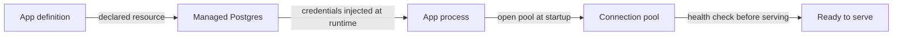
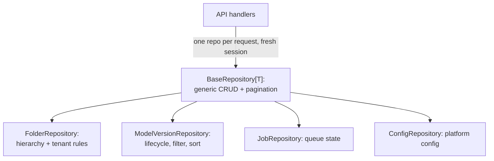
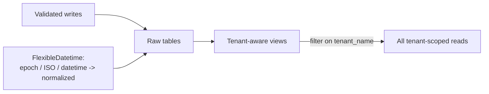
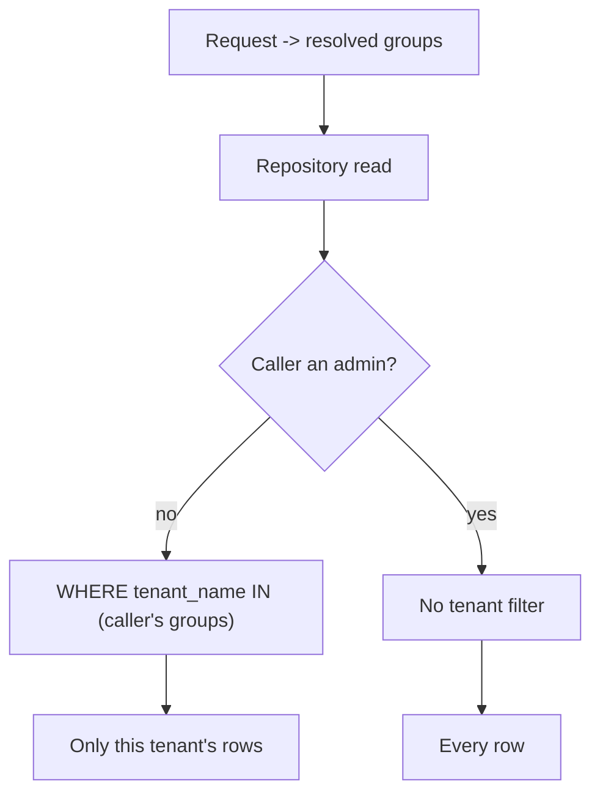
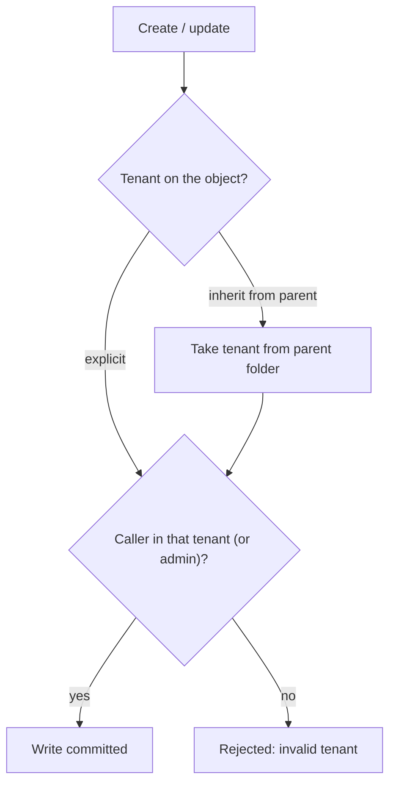
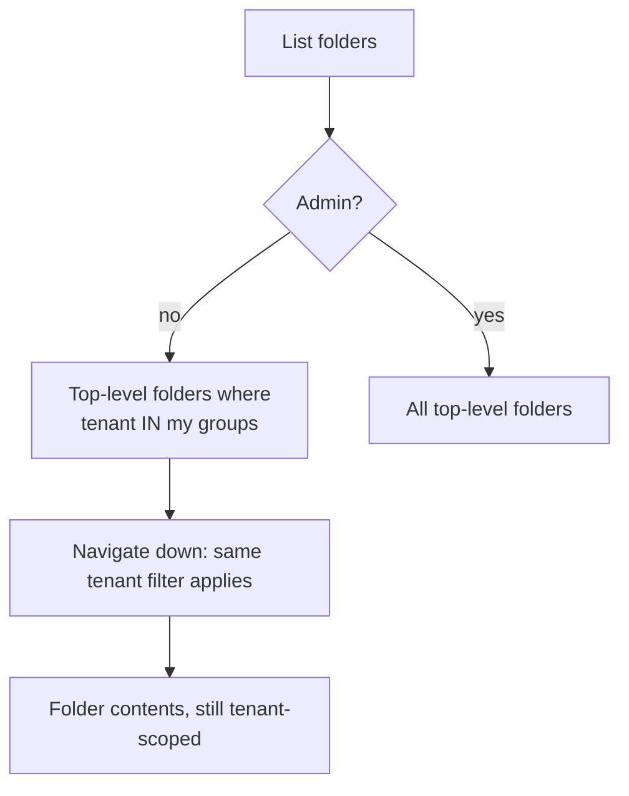
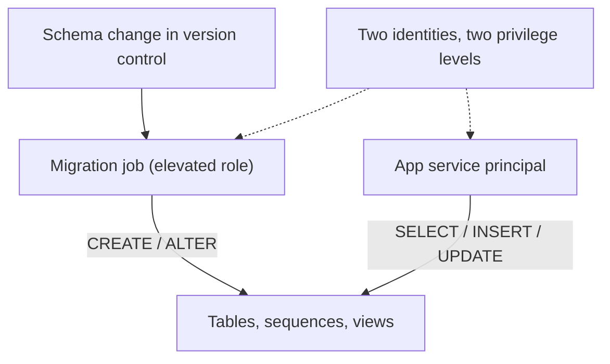
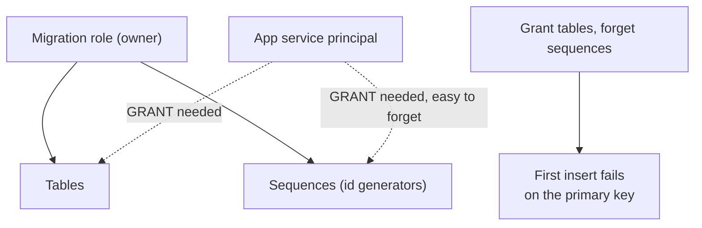

## Why this part exists

In the first article we called the metadata layer "a managed Postgres database" and moved
on. In the second we leaned on it constantly, the queue's whole claim to correctness is that
the database remembers what the process forgets, but we never really opened it up. This part
is that database: the thing that holds every model, folder, job record, and config, that has
to keep each team's data invisible to every other team, and that has to survive a schema
change and a redeploy without losing anyone's work.

None of the data modeling here is exotic. What made it worth writing down is the combination:
one database, many tenants, two different identities touching it, and a platform that
provisions the connection for us in ways we do not fully control.

## Managed Postgres, handed to us by the platform

The database is a managed Postgres instance, bound to the app as a declared resource rather
than configured by hand. We never write a connection string into a config file. The platform
injects the credentials at runtime, the app opens a pooled connection at startup, health-checks
it before serving a single request, and reuses that pool for the life of the process.

The upside of this is the same theme that runs through the whole series: the sensitive
material is declared, provisioned, and handed to the app by the platform, never checked in.
The downside, which we will come back to, is that "the platform provisions the connection for
us" also means the platform decides what privileges the app's identity has on the objects in
that database, and that decision is not as stable as we assumed.

## The repository pattern, and why we kept it boring

Every table is reached through a repository, and we were deliberate about keeping that layer
dull. There is a generic base repository that knows how to do create, read, update, delete,
list, and paginate for any model. Then there are a couple of specialized repositories that
add the domain rules on top: one for folders, one for model versions, and smaller ones for
jobs and config.

The reason this mattered more than it looks is tenancy. If access control were scattered
across the API handlers, every new endpoint would be a fresh chance to forget a filter and
leak another tenant's data. By pushing the tenant rules down into the repositories, the
dangerous logic lives in a handful of methods that every path goes through, instead of being
sprinkled across dozens of handlers. The boring base class is what makes the interesting
security property enforceable in one place.

Each request gets a fresh repository bound to a session drawn from the pool, does its work,
and lets the session go. Nothing stateful survives the request. That is the same disposability
principle the queue relies on, applied to data access.

## Models, views, and the shape of the data

The models are defined with SQLModel, which gives us SQLAlchemy tables and Pydantic validation
from the same class. A model version carries the usual metadata plus some genuinely messy
fields, nested configuration, metric maps, threshold tables, that we store as JSON columns
rather than trying to normalize into a dozen side tables nobody would enjoy joining.

Two details earned their keep. The first is a flexible datetime type that accepts whatever the
callers throw at it, epoch seconds, ISO strings, real datetime objects, and normalizes them,
because the data arrives from notebooks, the UI, and the engine, and they do not agree on a
format. The second is that reads mostly go through database views rather than the raw tables.
The view is where the tenant column lives in a predictable place, which makes the access-control
filter uniform: every tenant-scoped query filters the same view on the same column, instead of
each table having its own slightly different notion of ownership.

## Multi-tenancy is a filter, not a database

Here is the central decision, and the one most worth defending: every tenant shares the same
database and the same tables. Isolation is a filter applied on every read, not a separate
schema or a separate instance per tenant.

The mechanism is simple on purpose. Every request resolves, through the identity flow from the
first article, to a set of group memberships. Those groups are the user's tenants. Every
tenant-scoped read narrows its query to rows whose tenant matches one of the caller's groups.
A user with no matching group sees nothing; a user in two tenants sees the union of both. The
filter is not optional and not something the handler opts into, it is baked into the repository
method, so there is no code path that reads tenant data without it.

We considered the alternatives honestly. A database per tenant gives the strongest isolation
but turns every migration into N migrations and every cross-tenant admin view into a fan-out.
A schema per tenant is lighter but still multiplies the operational surface. For an internal
platform where tenants are teams in the same company, sharing a workspace, a shared database
with a mandatory filter was the right trade: one migration, one connection pool, one place to
reason about, and isolation that lives in code we can test rather than infrastructure we have
to replicate.

The cost we accept is that the filter is load-bearing. If it were ever omitted on a new query,
that is a data leak, not a bug you notice later. That is exactly why it lives in the repository
and not in the handler.

## The admin bypass, and keeping it honest

There is one group that sees across all tenants: the admin group. When the caller's groups
include it, the tenant filter is skipped entirely and the query returns everything. This is
what makes platform administration and support possible, someone has to be able to see the
whole picture.

The thing we were careful about is that the bypass is a single, explicit check in the same
place as the filter, not a scattering of special cases. The repository asks one question, is
this caller an admin, and either applies the filter or does not. Keeping the bypass adjacent
to the rule it bypasses means you can read both in one glance and reason about exactly who sees
what. A privilege escalation path that is spread across the codebase is one you cannot audit; a
single branch you can.

## Writes are where tenancy gets enforced

Reads filter. Writes validate. They are different problems and we kept them separate.

On a read, the worst case of a missing filter is a leak. On a write, the worst case is worse:
a user stamping a row with a tenant they do not belong to, planting data inside someone else's
boundary. So create and update do not just trust the tenant value on the incoming object. They
check it against the caller's groups, and if the caller is trying to write into a tenant they
are not a member of, and they are not an admin, the write is refused outright.

There is a nicety on top: when a new object does not specify a tenant, it inherits the tenant
of its parent in the hierarchy, so the common case needs no ceremony and still lands in the
right boundary. The validation only has teeth when someone tries to set a tenant explicitly,
which is exactly when you want it checked.

## Folders: a hierarchy that is also a boundary

Folders are the organizing structure users actually touch, and they are where tenancy and
hierarchy meet. A folder has a parent, so folders form a tree, and a folder has a tenant, so
the tree is partitioned. The rule we settled on is that you only see the top of your own
tenant's trees: a non-admin listing folders sees the top-level folders in their tenants and
nothing from anyone else's, and the same filter follows them as they navigate down.

Deletes and updates on a folder route through the same tenant-scoped existence check that reads
do. Asking for a folder outside your tenants returns nothing, so an update or delete against it
simply finds no folder to act on, rather than needing a separate permission error. The access
rule and the lookup are the same operation, which means there is no second code path that could
disagree with the first.

## Migrations run as someone else

Schema changes do not go through the app. They go through a separate migration process, run
with a role that has the authority to create and alter tables, sequences, and views. The app at
runtime has no such power, it connects as its own service principal identity and does nothing
but read and write rows.

This separation is good hygiene, the thing that can reshape the database is not the thing
exposed to the internet, but it sets up the single most confusing bug in the whole platform,
which we told from the deployment side in the first article and will now tell from the data
side, because down here is where it actually lives.

## The grant trap, revisited from the data side

When the migration role creates a table, that role owns it. Postgres does not hand a second
identity any access to objects a different role created. So the app's service principal, which
only ever reads and writes, needs explicit grants on every table it touches, and, the part that
is so easy to miss, on every sequence behind the auto-incrementing primary keys. You can grant
read and write on all the tables, watch the app connect cleanly, and then watch the very first
insert fail, because generating the next id means touching a sequence the app was never granted.

That much is standard Postgres. What made it a genuine trap is that the grants did not stay
put across deploys. A working app would come back from a redeploy unable to read its own tables,
with nothing in the code changed, because how the platform provisions the app's database binding
is not perfectly stable across tool versions, and a reprovision could quietly drop the grants we
had carefully applied.

The fix is the one worth carrying away from this entire series: treat the grants as data, not as
a one-time manual act. Re-granting the app identity its table and sequence privileges is part of
bringing the database up to date, it runs every time, and it is idempotent, so whatever a deploy
does to the permissions, the next reconcile puts them back. And pin the tooling, because letting
the deploy tool's version drift is enough to resurrect the whole problem, and when it comes back
it does not look like a permissions bug, it looks like the app forgot how to read a table.

## Small decisions that paid off

A few modest choices did more work than their size suggests. Pagination is baked into the base
repository and returns a consistent envelope with totals and page counts, so no endpoint
reinvents it and the UI can rely on one shape. Validation lives on the models, so a bad payload
is rejected at the boundary with a clear error instead of becoming a confusing failure three
layers in. And comparing JSON for equality treats a missing value, an empty string, and an empty
list as the same thing, which sounds pedantic until you are diffing a model's config to decide
whether something actually changed, and the three "empty" representations would otherwise produce
a stream of phantom edits.

## What we keep wishing for, part three

The wish here is narrow and, by now, familiar: we would love the app's identity to simply inherit
the access it needs to the database it was handed, and to keep that access across a redeploy
without us re-granting it every time. We bound the database to the app declaratively; the
declaration should have been enough. Instead the effective grant and the declared binding drifted
apart, and the gap between "declared" and "effective" is where we lost the most time, on the
data side exactly as on the governance side.

But, as in the earlier parts, this is not a complaint so much as a map of where the platform
bends. A shared database with a mandatory tenant filter gave us real multi-tenancy we can test
instead of replicate. The repository pattern gave us one place to enforce it. And the grant trap,
once we learned to write the grants down as code and run them every deploy, stopped being a
mystery and became a checklist item. The data layer is quiet now, which, for a data layer, is the
highest praise there is.
