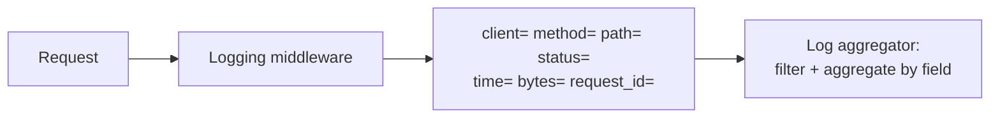
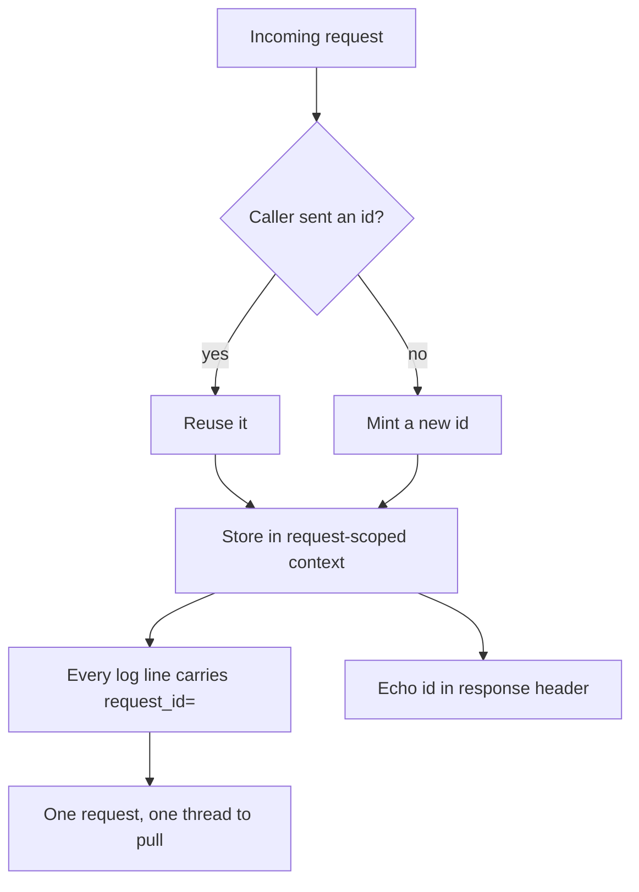
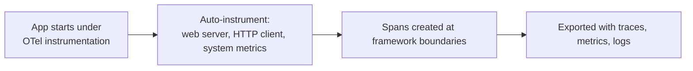
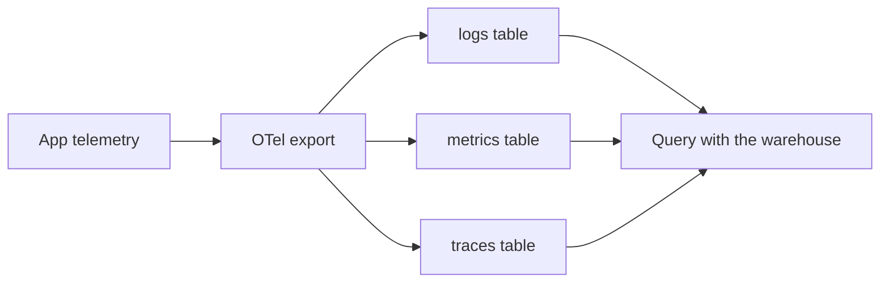
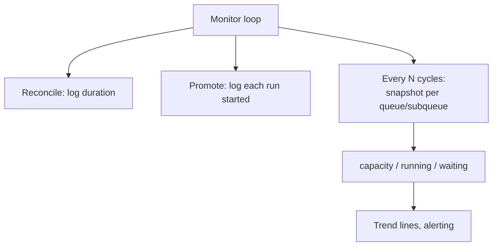
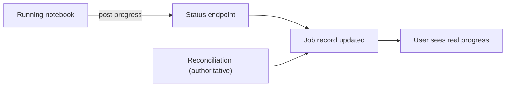
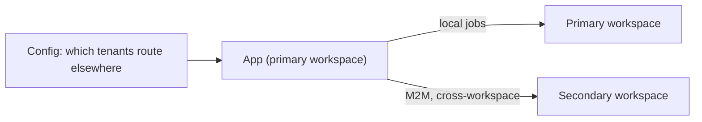
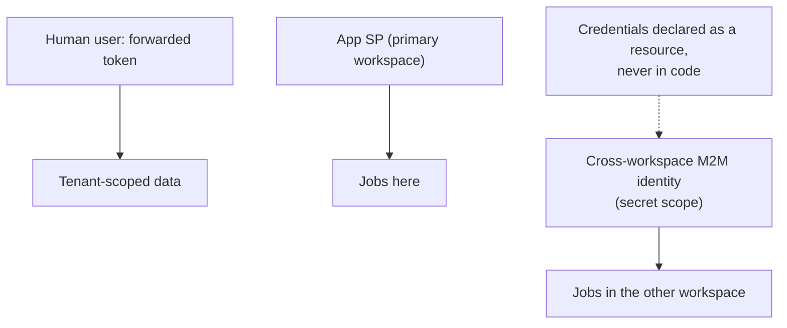
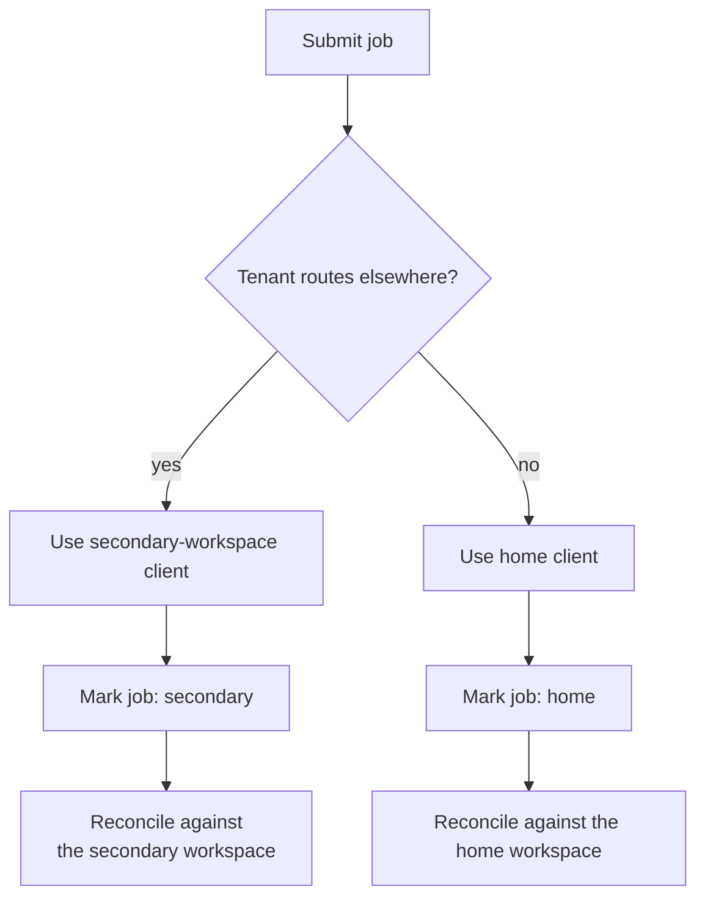
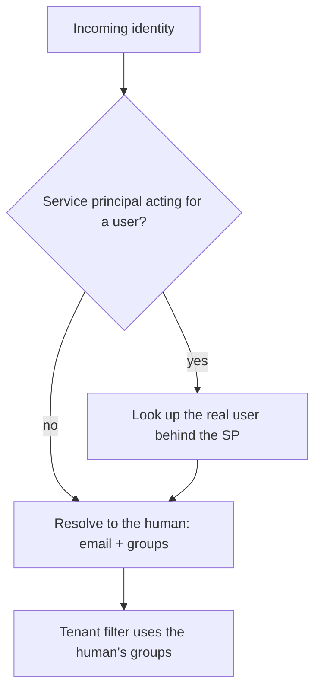

## The two problems nobody demos

Every demo of a platform like this stops at the happy path: a request comes in, a job runs, a
row is written. What the demo never shows is the Tuesday afternoon when a single user's jobs
are failing and nobody can say why, or the moment a tenant's work has to run in a completely
separate Databricks workspace with its own identity and its own rules. Those two problems,
seeing the system and reaching across workspaces, are what this part is about. They are
unglamorous, and they are exactly what separates something you can run from something you can
only build.

## Logs you can actually search

The first thing we did, before any fancy tracing, was make the logs structured. Every access
log line is a set of key-value pairs, not a sentence. Client, method, path, status, elapsed
milliseconds, response size, and an id, all as `key=value`, so the log aggregator can filter
and aggregate on any field instead of us writing fragile regexes against prose.

It is a small discipline with an outsized payoff. "Show me every request slower than two
seconds for this path today" is a query, not an afternoon. A wall of free-text log lines
cannot answer that; a stream of structured records can. The whole point is that the logs are
data, not narration.

## A request id that follows the work

The single most useful thing in the whole observability story is also the cheapest: every
request gets an id, and that id follows it everywhere. The middleware either accepts an id the
caller already sent or mints a fresh one, stashes it somewhere every log statement in the
request can reach, and echoes it back in a response header so the client knows which id their
call got.

Once that id is on every line, debugging changes character. Instead of guessing which of a
hundred interleaved log lines belong to the failing call, you grep one id and the entire
request reassembles itself in order. When a user reports a problem and can read back the id
from their response header, you go straight to their exact request. It is the difference
between investigating and searching.

## Tracing without instrumenting by hand

For distributed tracing we leaned on OpenTelemetry, and the choice that saved the most effort
was to let the auto-instrumentation wrap the web server rather than hand-annotating code. The
app launches under an instrumentation wrapper, and the web framework, the outbound HTTP calls,
and the system metrics come traced out of the box. We did not sprinkle span-start and span-end
calls through the codebase; the framework boundaries became spans automatically.

The lesson we took is that the first 80 percent of tracing value comes from instrumenting the
edges, requests in and calls out, and that is precisely the part you can get for free. We can
always add hand-rolled spans later for a specific hot path, but starting from automatic
edge-level tracing meant we had useful traces on day one instead of after a refactor.

## Telemetry lands in the warehouse

Here is the part that feels distinctly Databricks: the traces, metrics, and logs do not go off
to some third-party observability vendor. They export to tables in the warehouse, in the same
governed catalog and schema as everything else. The telemetry is just more data, queryable with
the same SQL and governed by the same access controls as the platform's own records.

This turned out to be unexpectedly powerful. Because the telemetry sits next to the business
data, a question like "did the slow requests correlate with a particular tenant's jobs" is a
single join, not a two-system correlation exercise with timestamps that never quite line up.
The observability data and the thing being observed live in the same place, under the same
governance, and that is a genuine advantage of staying inside the platform instead of shipping
logs out of it.

## Watching the queue from the outside

The job queue from part two has its own observability needs, because a background loop is
invisible by default, it does its work and sleeps, and if it quietly stops promoting jobs you
want to know before a user does. So the loop narrates itself. Each reconciliation logs how long
it took, each promotion logs the run it started, and every so many cycles the loop emits a
snapshot of every queue and subqueue: capacity, how many are running, how many are waiting.

The periodic snapshot is the one we rely on most. A single snapshot tells you the queue's state
right now; a history of snapshots tells you whether waiting is creeping up, whether a queue is
chronically saturated, whether the loop is even still ticking. It turns an invisible background
thread into something with a pulse you can watch.

## Letting the notebook talk back

A running notebook is opaque to the app, from outside, all you get is the platform's lifecycle
state. So we gave the notebook a way to report in: a small endpoint the notebook can post a
status to partway through, which the app records against the job. It is optional, the authoritative
signal still comes from reconciling against the platform, but it means a long job can say where it
is instead of looking hung.

The design rule we held to is that the callback is a convenience, never the source of truth. If
the notebook never calls, the job still resolves correctly through reconciliation, because a
status system that breaks when one optional signal goes missing is worse than no signal at all.
The callback enriches the picture; it is not load-bearing.

## When the work lives in another workspace

Now the second half. For most tenants, work runs in the same workspace the app lives in. For at
least one, it does not, the work has to execute in a separate Databricks workspace entirely, with
its own URL, its own identities, and its own governance. The app has to reach across that boundary
and run jobs over there as cleanly as it runs them at home.

The thing that makes this tractable is that "which workspace does this run belong in" is a
configuration question, not a code question. A list of tenant names in the queue config decides
who routes to the secondary workspace. Everything else, submission, reconciliation, tagging, is
identical; only the client the app talks through changes.

## Three identities, across two workspaces

The identity picture, which was already three-sided in the first article, is where crossing
workspaces gets real. There is the human user and their forwarded token. There is the app's own
service principal in the primary workspace. And there is a third, cross-workspace machine identity
used to authenticate into the secondary workspace, with credentials that live in a secret scope and
never appear in code.

Keeping these three straight is most of the work. The app holds two separate clients, one for
home, one for the secondary workspace, each authenticated as a different identity, and the right
one is chosen per job based on the tenant. The cross-workspace credentials are bound to the app as
a resource and surfaced as environment variables, the same declarative pattern as the database and
every other secret: handed to the app by the platform, not committed.

## Routing a job to the right workspace

When a job is submitted, the queue asks one question before it does anything else: does this job's
tenant route to the secondary workspace? If so, every interaction for that job, creating the
durable job, triggering runs, listing active runs during reconciliation, goes through the
secondary-workspace client. If not, it uses the home client. The job record carries a flag marking
which world it belongs to, so later cycles reconcile it against the correct workspace without having
to re-derive the routing.

The flag on the record is what keeps this honest across restarts. When the app comes back and
rebuilds its state from the database, it already knows which workspace each in-flight job lives in,
so it points each reconciliation at the right place. Routing decided once at submit time, remembered
on the record, is far less error-prone than re-deciding it every cycle.

## Unwinding a service principal back to a person

The sharpest edge in the cross-workspace world is identity resolution. In the normal case the
forwarded token belongs to a human and resolving it yields their email and groups. But across
workspaces, and while the native user-to-machine flow was still rolling out, the caller can arrive
as a service principal standing in for a user. If we took that at face value, the "who are you" step
would resolve to a robot, and the tenant filter would apply to the robot's groups instead of the
person's, which is either an empty result or the wrong one.

So the resolution step has to detect the stand-in case and unwind it back to the real person before
anything downstream runs. It is a small branch, but it is the linchpin that keeps tenancy correct
when identity arrives indirected through a machine. Get it wrong and a user in the secondary
workspace either sees nothing or, worse, sees through the wrong lens. This is the same "a caller is
not always a human" lesson from part two, showing up again at the identity layer instead of the
ownership layer, because it is the same truth wearing a different hat.

## What we keep wishing for, part four

The observability wishlist is short, because staying inside the platform worked out well: telemetry
in governed warehouse tables, next to the data it describes, is genuinely better than shipping logs
to a far-off vendor, and we would not trade it back. If anything, we wish the request id that we
thread by hand were a first-class, platform-wide primitive that every app and every job inherited
automatically, so a single id could follow a click from the browser all the way into a run in
another workspace without us stitching it together.

The cross-workspace wish is bigger and ties the platform story together. Every hard part of reaching the
second workspace came down to identity: holding two clients, unwinding a service principal back to a
person, remembering which world a job lives in. A platform notion of "this user, acting as themselves,
in whichever workspace the work happens to run" would collapse most of that machinery. It is the same
wish that opened the series, a first-class cross-app, and now cross-workspace, identity story, just
seen from the far end of the system.

And that is the thread through these four parts. The platform gives you an enormous amount for free:
declarative infrastructure, injected credentials, auto-instrumented tracing, governed telemetry,
managed compute. The work, the real work, lives in the seams between those gifts, in auth handshakes
and grant reconciles and identity unwinds and workspace routing. Finding those seams, and building
something solid across them, was the whole point. It was also, as we said at the very start, most of
the fun.
