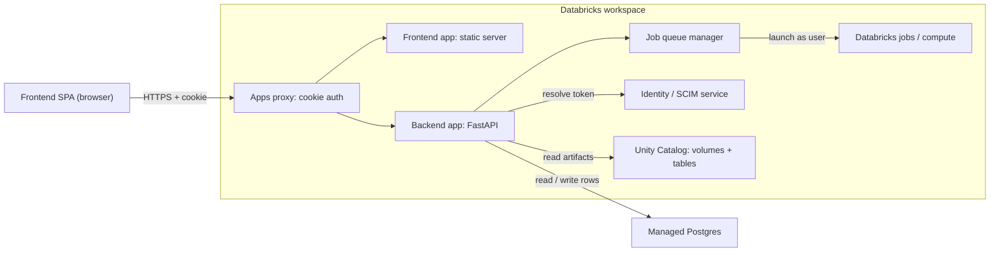
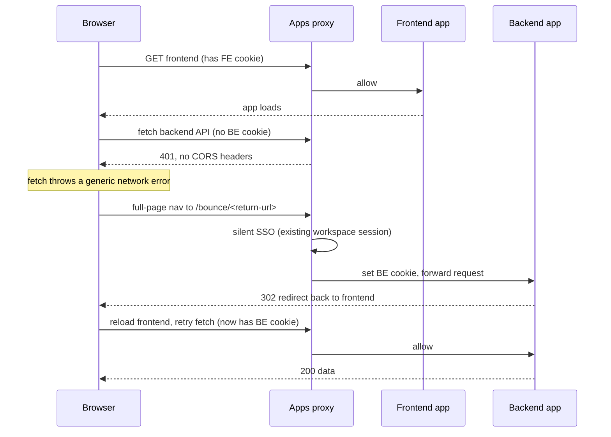
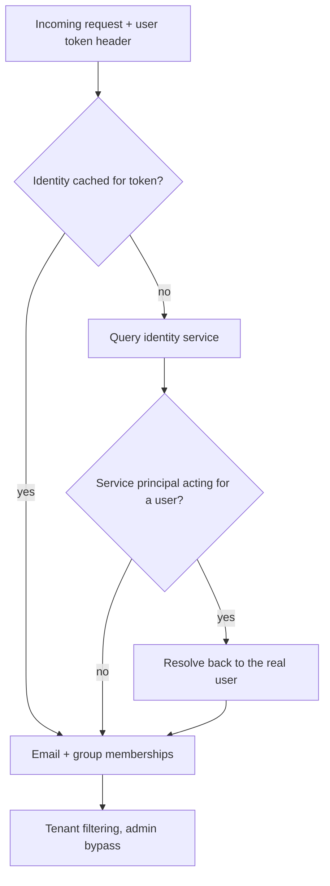
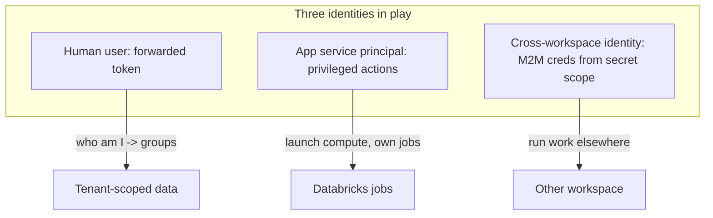
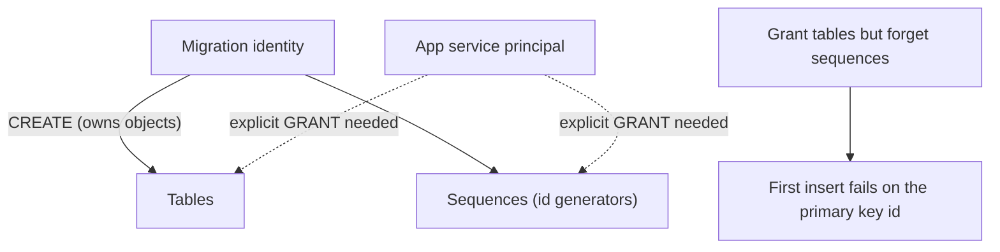
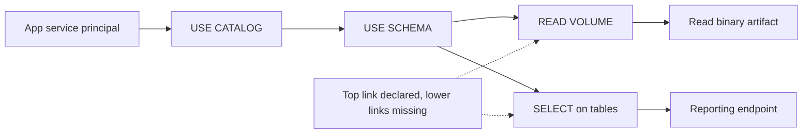
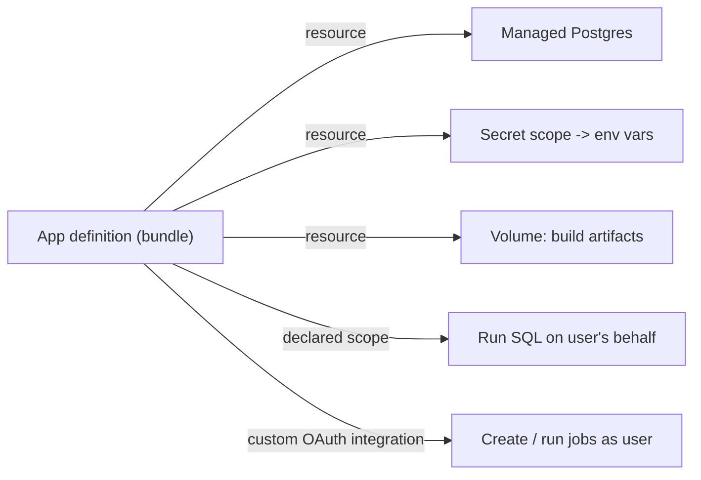
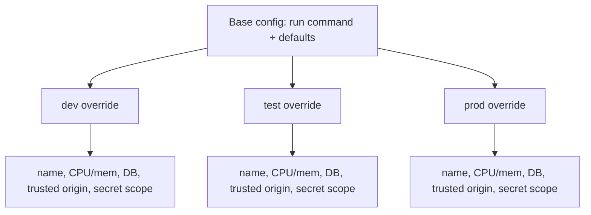
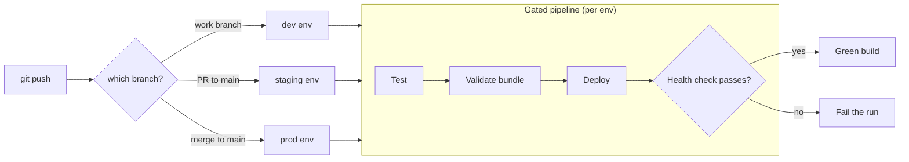
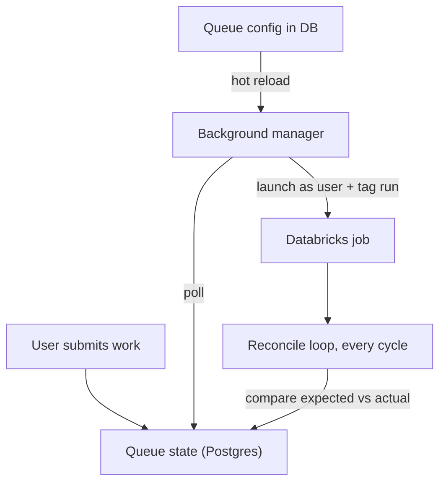

I have spent the last stretch building on Databricks Apps, and I want to write down
what I learned, partly because I keep forgetting the details myself, and partly because
most of it is not written down anywhere. Databricks Apps is a good platform. It is also
young, and once you push past the demo-app stage you start running into the seams. This
is a tour of those seams and what I did about them.

For context, the thing I am building is an internal platform for machine learning
experimentation and model management, with Databricks as the backbone. Teams use it to
organize models, run training and scoring experiments on Databricks compute, compare
results across versions, track metrics, and manage the configuration around all of it.
The metadata layer, the models, versions, experiment records, queue state, and
configuration, lives in a managed Postgres database, while the heavy compute runs on
Databricks. Different teams share the same platform but should only see their own work,
so multi-tenancy and access control run through everything. None of that is exotic on
its own. What made it interesting is where the platform met the edges of Databricks Apps.

The setup is two apps that ship as one product: a web frontend and a backend API. They
talk to each other constantly. That single fact, two apps instead of one, is where most
of the interesting problems came from.

## System at a glance

At a high level the product is a browser frontend and a backend API, both running as
separate Databricks Apps behind the platform proxy, with metadata in managed Postgres
and heavy compute on Databricks. Everything a user sees is filtered by the groups their
token resolves to.

## Two apps, one product

Every app on Databricks Apps gets its own subdomain. That sounds harmless until you
realize each subdomain gets its own auth cookie, and the platform's proxy checks that
cookie before your code ever runs. So the very first time the frontend tries to call the
backend, the browser has a cookie for the frontend's domain and nothing for the
backend's. The proxy sees a request with no cookie and rejects it with a 401, and it does
so without any CORS headers. The browser cannot even read the response. From the
frontend's point of view the fetch just throws a generic network error.

You cannot fix this with a token. Even if you hold a perfectly valid access token, the
proxy checks the cookie first, and no cookie means blocked before your headers are read.
There is no CORS configuration you can set, because the rejection happens above your app.

## The bounce

The workaround I landed on is a redirect handshake. When the first backend call fails, I
send the browser on a full-page navigation to a bounce endpoint on the backend, carrying
the original page URL along so we can come back. Because the user already has a live
session with the workspace, the proxy does a silent single sign-on: no login prompt, it
just sets the backend's cookie and lets the request through. My bounce endpoint then sends
a redirect straight back to the frontend. The page reloads, the same fetch runs again, and
this time the browser has the cookie, so everything works.

Two details cost me real time here.

First, I originally passed the return URL as a query parameter. It kept vanishing. It
turns out the OAuth redirect chain strips query parameters somewhere in the middle, so by
the time you land back home the parameter is gone. The path survives, though, so I encode
the whole return URL into the path of the bounce request instead. Ugly, but reliable.

Second, sometimes even the path gets eaten and the user lands on the bare root of the
backend with nowhere to go. So the root route has a fallback that just sends them back to
the frontend's origin. By that point the cookie is already set, so the redirect is only
about not stranding the user on a blank page.

The last piece is keeping the cookie warm. It expires after a few minutes of idle time,
and when it does, the user comes back from a coffee break and gets the whole redirect
dance again, complete with a page flash. So the frontend quietly pings a health endpoint
on the backend every few minutes with credentials attached. That touch resets the expiry
and the user never notices.

One thing I was careful about: a bounce endpoint that redirects wherever the URL tells it
to is an open redirect waiting to be abused. So it only ever redirects to hosts that match
the workspace's own domain pattern. Anything else is refused.

## Who are you, really

Once a request actually reaches the app, there are two separate questions to answer, and
keeping them separate made everything cleaner. The cookie answers "are you allowed to talk
to this app at all." That is the proxy's job. The token answers "who are you," and that is
mine.

The platform injects the user's access token into every request as a header. I take that
token and ask the workspace's identity service who it belongs to, which gives me the
user's email and, importantly, their group memberships. That identity lookup is not free,
so I cache it per token. The groups drive everything downstream: the app is multi-tenant,
and a user only sees the data their groups grant them, with an admin group that sees
across the whole thing.

There is a wrinkle. A native version of the user-to-machine identity flow was still
rolling out while I was building, so I resolve identity by hand against the identity
service rather than waiting on the built-in helper. There is also a case where the caller
is actually a service principal standing in for a user, and I have to unwind that back to
the real person.

In total there are three identities floating around at any moment. There is the human
user, represented by their token. There is the app itself, which runs as its own service
principal and uses that identity to do privileged things like launching compute. And
there is a third, cross-workspace identity used when work has to run in a different
workspace than the one the app lives in, authenticated machine-to-machine with
credentials that never appear in code.

## Asking for the right scopes

There is a subtlety in the token the platform hands you. By default the user's token that
gets forwarded to your app can only do a narrow set of things. If your app needs to act on
the user's behalf against other parts of the workspace, warehouses, query execution,
whatever, you have to declare the extra scopes you want up front, in the app's own
definition. Miss one and you do not find out until a call that should work comes back
denied, with an error that does not obviously point at a missing scope.

So the app declares the scopes it needs as part of its deployed configuration. In my case
the interesting one is the ability to run SQL on the user's behalf, which the app uses to
serve some of its warehouse-backed views. The platform then layers a couple of baseline
identity scopes on top of whatever you ask for, so what the app actually ends up with is
the SQL scope plus read access to the current user's identity and group memberships. That
last part matters, because it is exactly what the identity lookup earlier depends on. The
lesson I took away is that scopes are not something you bolt on at runtime by asking nicely
in a header. They are declared with the app, provisioned at deploy time, and if you change
what your app needs to do, you change the declaration and redeploy.

The one that took real work was launching jobs as the user. The whole point of the backend
is that when you submit a run, it executes under your identity, with you as the owner, so
ownership and access come out right instead of everything running as a faceless app
account. But the forwarded user token does not come with the authority to create and run
jobs out of the box. There is no checkbox for it in the standard set of scopes. Getting the
app permission to submit work on a user's behalf meant setting up a custom integration on
the workspace side, an OAuth integration scoped specifically to let this app act for the
user against the jobs surface, and then wiring the app to request that scope. It is not the
kind of thing you can do purely from inside your own repo; it needs a workspace-level
integration to exist first, and then the app opts into it. Until that piece was in place,
every attempt to run a job on the user's behalf came back unauthorized, and the error gave
no hint that the fix lived in an integration I had not created yet.

## The permission trap

This is the one that cost me the most confusion, because the symptom and the cause live in
completely different places.

The database is managed Postgres. Schema changes go through a separate migration job that
runs as a role with the rights to create tables, sequences, and views. The app, at
runtime, connects as its own service principal identity and just reads and writes rows. So
far so normal. The catch is that the objects the migration creates are owned by the
migration's identity, not the app's. Postgres does not automatically hand a second identity
access to tables a different role created. The app's service principal needs explicit grants
on every table, and, crucially, on every sequence behind the auto-incrementing primary keys.
That sequence part is the easy one to forget: you grant read and write on the tables,
everything looks fine, and then the first insert blows up because the app cannot touch the
sequence that generates the id.

That alone is just standard Postgres hygiene. What turned it into a genuine trap was that
the grants did not stay put. I would have a working app, redeploy it, and suddenly it could
not read its own tables anymore. Nothing in my code changed. What changed was the deploy.

The thing I eventually pieced together is that how the app's database binding gets
provisioned is not perfectly stable across tool versions. Deploying with one version of the
CLI would wire up the app's Postgres access one way; deploying with a different version, or
after the platform's own provisioning behavior shifted underneath me, would wire it up
differently, and in the process the carefully applied grants on the existing tables and
sequences would effectively be lost. The app comes back up, connects fine, and then falls
over the moment it touches a table, because the identity it connects as no longer has the
privileges it had an hour ago.

What took me longer to appreciate is that this is not really a Postgres story at all. It is
a service-principal-grant story, and it repeats anywhere the app relies on a privilege that
lives outside the app's own code. The same shape shows up on the data-governance side: the
app declares, right there in its own definition, that it should be able to read a particular
storage volume and query a particular set of governed tables. The declaration is
necessary, but it is not the same thing as the grant being effective. I hit this twice from
opposite directions. In one case the app tried to read a binary artifact out of a volume it
was supposed to have access to, and the call came back forbidden, because the effective
grant chain the platform needs, use the catalog, use the schema, then read the volume, was
missing its lower links even though the top one was present and the app's spec listed the
volume. In another, a reporting endpoint that reads a few governed tables started failing
for every request, and the cause was the same species of gap: the app's identity had a path
into the schema but no actual read privilege on the tables underneath, so every query threw.
Neither looked like a permissions problem from the front end. One looked like a corrupt or
missing file; the other looked like the reporting feature was simply broken. Both were the
app's service principal quietly lacking a grant that everyone assumed it already had because
the app declared it.

Two things made this survivable. First, treat the grants as part of the migration, not as a
one-time manual fix. Re-granting the app identity its privileges, table and sequence access
on the database side, catalog, schema, volume and table access on the governance side, has
to be idempotent and has to run as part of bringing an environment up to date, so that
whatever a deploy does to the permissions, the next reconcile puts them back. Second,
pin your tooling. Casually letting the CLI version drift between deploys is enough to
resurrect this on its own, and when it comes back it does not look like a permissions
problem, it looks like your app suddenly forgot how to read a table. If I could give one
piece of advice to anyone standing up an infrastructure-backed app here, it is to write the
grants down as code, run them every deploy, verify them as effective rather than merely
declared, and be suspicious of any environment where the version of the tool that deploys
the app is allowed to wander.

## Wiring the app to real infrastructure

The nice surprise with Databricks Apps is that you can bind real infrastructure to an app
declaratively instead of gluing it together at runtime. I lean on that hard.

The database is a managed Postgres instance attached to the app as a resource, with the
permission it needs and nothing more. The runtime injects the credentials, so there is no
connection string sitting in a config file. The app just opens a pooled connection at
startup and health-checks it before serving traffic.

Secrets for the cross-workspace identity live in a secret scope, bound to the app as a
resource and surfaced as environment variables. Same story for storage: the app has
scoped read and write access to a volume where it keeps its build artifacts. The theme
across all of this is that the sensitive material is declared as a resource and handed to
the app by the platform, never checked in.

## Shipping it

Deployment goes through declarative bundles, and the shape that worked for me was layered.
There is a static, environment-agnostic base that sets the run command and a few defaults.
Then there are per-environment overrides that fill in everything that changes between dev,
test, and prod: the app's name, how much CPU and memory it gets, which database it points
at, which frontend origin it trusts, which secret scope it reads. The app name itself is
templated off the target so each environment gets its own cleanly named instance.

I also package a couple of internal libraries as wheels and stage them into the app at
deploy time rather than pulling them from a registry. It keeps the deploy self-contained.

The lesson that bit me hardest lives here. The shared CI reads bundle variables out of
each target's own block and turns them into environment variables. I assumed a top-level
default would flow down into every target. It does not. If a target does not restate the
variable, CI sees it as empty, and you get a deploy that points at a half-built path
because a value silently came through blank. The validation step does not catch it,
because as far as the bundle is concerned the default exists. The fix is boring: repeat
the constant values in every target block, even though it feels like duplication.

## The pipeline

Continuous delivery is a gated pipeline: test, then validate the bundle, then deploy. The
branch you push to decides where it goes. Work branches deploy to the dev environment,
pull requests into the main line deploy to a staging environment, and merging to main
ships to production. There is also a manual trigger for when you want to force a specific
environment. Each environment carries its own host and token as protected secrets, so a
dev deploy physically cannot reach production credentials.

The part I am happiest about is the last step. After every deploy the pipeline asks the
platform for the app's URL, curls its health endpoint, and fails the whole run if it does
not come back healthy. A deploy that produces a broken app is a failed deploy, not a green
checkmark and a surprise later.

## Two things I built on top

Two more pieces stretched the platform in ways worth mentioning.

The app runs its own job queue. Users submit work, and a background manager inside the app
launches it as real compute jobs, but under the submitting user's identity rather than the
app's, so ownership and access stay correct. Every launched job is tagged so the app can
find its own runs again later and reconcile what it thinks is running against what actually
is, every cycle. The queue's configuration lives in the database and hot-reloads, so I can
retune limits without a redeploy.

And the whole thing is instrumented. Tracing wraps the web server, and traces, metrics,
and logs all export to tables in the warehouse. Every request gets an id that follows it
through the logs, and the access logs are structured key-value so they are actually
searchable instead of being a wall of text.

## What I keep wishing for

If I could hand Databricks a wishlist, it would start with a cross-app auth story. Two
apps, same workspace, same already-authenticated user, and I still need a full-page
redirect round trip just to hand one of them a cookie. A workspace-scoped cookie, or a
proxy that understood CORS, or honestly any first-class cross-app mechanism, would delete
the most complicated code in the whole system.

None of this is a complaint, really. I got a genuinely multi-tenant, multi-environment,
multi-app product running on the platform, with real infrastructure bound declaratively
and a pipeline that refuses to ship something broken. The seams are just where the
interesting work was, and finding out where a platform bends is most of the fun of using a
new one.
