## Where we left off

In the first piece we described the app that submits work as "a background job queue that
launches runs under the submitting user's identity," and then we moved on, because the
article was about auth and deployment seams. That one sentence hides about a month of
work. This is the follow-up that opens it up: submissions, notebooks, queues, and the
cluster policies that tie them together. Everything here is about the backend API, the
FastAPI app that takes a request to run something and turns it into real compute on
Databricks.

The shape of the problem is simple to state. A user clicks "run" in the browser. Some time
later a notebook executes on a cluster, owned by that user, counted against a shared
concurrency budget, on hardware that the platform team controls and the user never sees.
Nothing between those two moments is simple.

## What "submit a job" actually means

The first thing that surprised us is that there is no single "submit" operation. There are
two completely different ways to run work on Databricks, and the names are confusingly
close: you can submit a one-shot run, or you can create a persistent job and then trigger a
run of it. We went back and forth and landed firmly on the second.

A one-shot run is fire and forget: you hand Databricks a task and a cluster spec, it runs,
and when it is done there is no durable object left that cleanly represents "this thing the
user asked for." A persistent job is a named, durable definition that lives in the
workspace. You create it once, and then every time you want it to run you call run against
its id. It shows up in the Jobs UI. It has an owner. It has an access control list. It has a
run history.

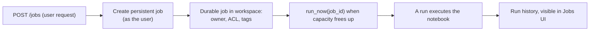

Creating the durable object up front, then triggering runs against it, is what makes the
rest of the system tractable. Ownership and permissions are decided once at creation. The
tags that let us find our own work later are baked in once. And the moment of actually
starting a run, which is the moment we need to rate-limit, is a cheap separate call we can
defer until the queue says there is room. Submission and execution become two different
events, and we get to control the gap between them. That gap is the queue.

## The notebook is the contract

The task every job runs is a notebook. Not a script, not a jar, a notebook sitting in the
workspace, referenced by its path. The app does not ship the notebook or generate it; it
points at one that already exists and hands it parameters.

That turns the notebook into an interface. The app passes a map of base parameters, and the
notebook reads them as its inputs: where the data is, which model, which configuration. The
contract between the web app and the compute is just "these parameter names, these
meanings." As long as the notebook agrees to read `input_path` and `model_version`, the app
can stay completely ignorant of what the notebook does with them.

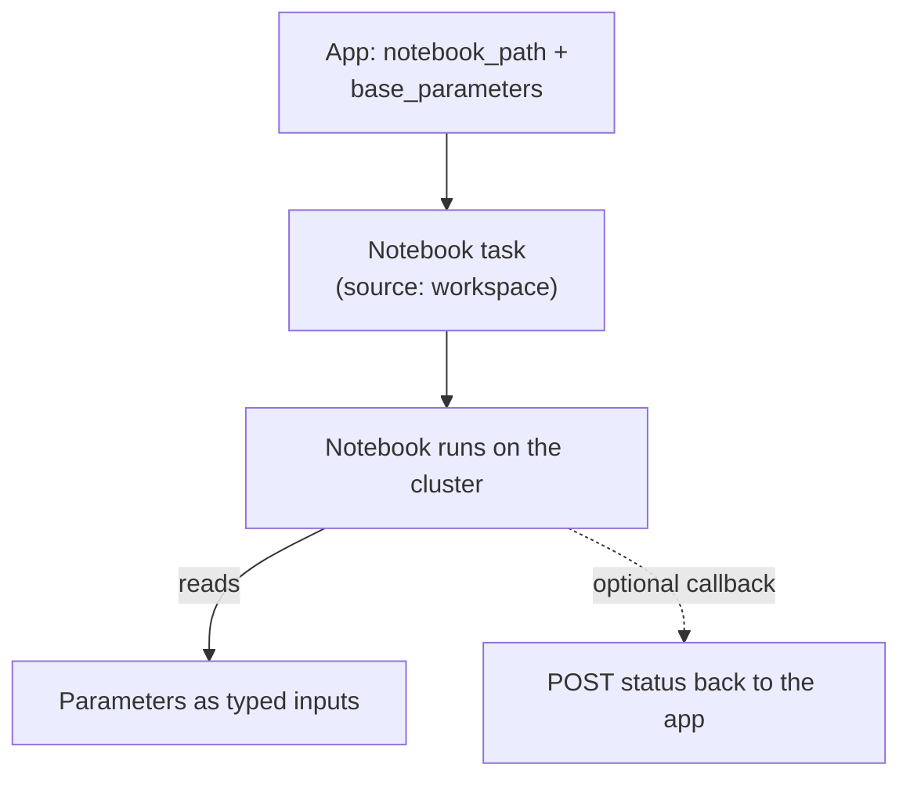

There is one nicety we added on top. A run is otherwise a black box to the app until it
finishes: all we can see from outside is the Databricks lifecycle state. So the notebook can
call back into the app partway through, posting a status update to a small endpoint, and the
app records it against the job. It is optional, and most of the signal still comes from
reconciling against Databricks, but it means a long-running notebook can say "I am 60
percent through" instead of looking frozen. The important design point is that the notebook
is the thing doing the work, and the app is the thing arranging for it to happen under the
right identity, on the right hardware, at the right time.

## Running as the user, not the app

The whole reason for the backend to exist is this: when you submit a run, it must execute as
you, not as the faceless service principal the app runs as. Ownership, data access, and
audit all have to resolve to the real person. If everything ran as the app's identity, every
model and every output in the workspace would be owned by one robot, and tenant isolation
would be a fiction.

So there are two identities involved in every submission, and keeping them straight took
some care. The persistent job is created using the user's forwarded token, so the user is
the creator. The run is configured to run as the user explicitly. And the access control
list is set at creation time so three parties have the right level: the user is the owner,
the app's service principal can manage it (so the background loop can cancel or reconcile
it later), and, if the user's tenant maps to a real workspace group, that group can manage
it too, so teammates are not locked out of their own team's runs.

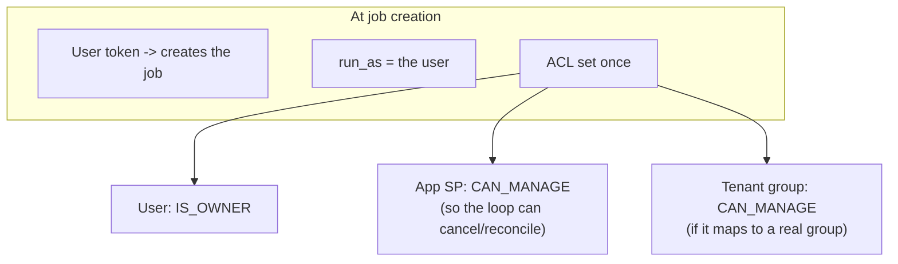

One wrinkle worth flagging, because it bit us: a caller is not always a human. Sometimes the
identity submitting work is itself a service principal standing in for a user. So the code
cannot assume the owner is a person. The tell we use is embarrassingly literal, whether the
identity string contains an "@", and we set it up as a user owner or a service principal
owner accordingly. It is the kind of branch you only write after the first time a non-human
submitter makes the whole thing fall over.

As we covered at length in the first article, getting the app permission to create and run
jobs on a user's behalf is not a checkbox. The forwarded user token does not carry that
authority by default; it took a workspace-level OAuth integration scoped specifically to let
this app act for the user against the jobs surface. Until that existed, every one of these
submissions came back unauthorized with an error that pointed nowhere near the actual fix.

## A queue that lives inside a web server

Here is the decision that every reviewer questions and that we would make again: the queue is
not a separate service. There is no broker, no scheduler process, no Redis. The queue lives
inside the FastAPI app as a background daemon thread. It wakes up on an interval, does its
work, and goes back to sleep.

The appeal is operational. There is one thing to deploy, one thing to monitor, one thing to
reason about. The app that accepts submissions is the same app that promotes them to
Databricks, which is the same app that watches them finish. No coordination protocol between
services because there is only one service.

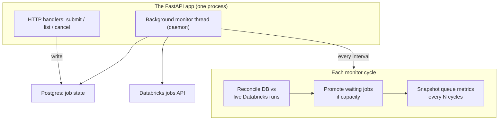

The honest cost of this choice is that an in-process queue is only as available as the
process, and only as coordinated as a single instance. If we ran several replicas of the app,
each with its own thread, they would trip over each other promoting the same jobs. We avoid
that by scoping everything to a single app instance: every job record is stamped with the
app instance that owns it, and the background loop only ever looks at jobs stamped with its
own name. It is a deliberate limit, not a distributed scheduler, and for an internal
platform at this scale that trade has been entirely worth it. The thread is a daemon, so when
the process exits it just dies with it, and the next startup rebuilds everything from the
database anyway.

## Two gates: parent queues and subqueues

Concurrency control has two levels, and they behave differently on purpose.

A parent queue is a named concurrency budget: "this queue runs at most five at a time." Jobs
are promoted in submit-time order, oldest first, plain FIFO. When the parent is full,
promotion for that queue stops entirely. That is the hard ceiling.

A subqueue is a softer, caller-declared limit that lives inside a parent. The point is
fairness: a single user or team should not be able to fill the whole parent budget with
their own runs and starve everyone else. So a submission can say "put me in subqueue
team-x, and team-x gets at most two concurrent." The crucial difference is what happens when
a subqueue is full. The parent being full is a stop gate, the loop breaks and promotes
nothing more. A subqueue being full is a skip gate, the loop passes over that job and keeps
looking at later jobs that might belong to a subqueue with room. One saturated team does not
block the rest of the queue behind it.

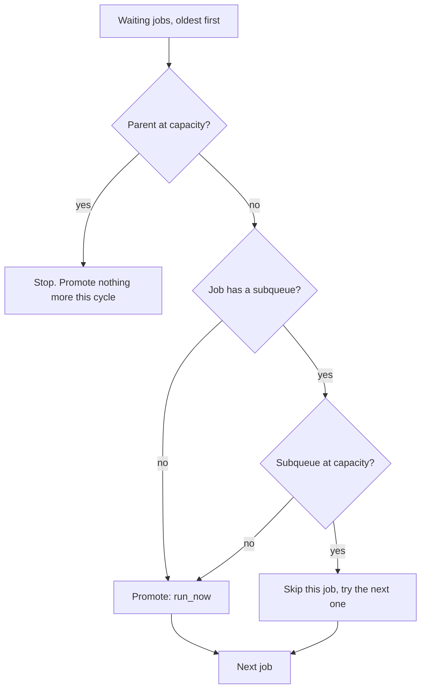

Two things make subqueues pleasant to operate. They need no configuration: a subqueue
springs into existence the moment someone submits into it, with the limit they declared, and
when the last job referencing it finishes, it is garbage collected and forgotten. And the
limit is last-write-wins, so the most recent submission's declared ceiling is the one in
effect. It means the whole subqueue mechanism carries no persistent config surface at all;
it is entirely reconstructed from the live jobs every time the app restarts.

## The database is the only thing that remembers

Because the queue lives in a process that can be redeployed at any moment, the in-memory
state is disposable. The database is the authoritative record, and the in-memory dictionary
of jobs is just a cache the loop rebuilds every cycle.

Every state transition writes to Postgres immediately: a new job lands as waiting, a
promotion flips it to running with its run id and url, a terminal state records when it
ended and why. Then, on every single cycle, the loop does a reconciliation pass that treats
Databricks and the database as two sources that must be made to agree:

- It lists the runs Databricks currently considers active.
- It loads every waiting-or-running job the database has for this app instance.
- Where the database says a job was canceled but Databricks still shows it running, it
  cancels the real run.
- Where the database says waiting but Databricks already shows it active (a run a previous
  instance of the app started before a redeploy), it promotes the record to running.
- Where the database says running but the job is no longer in the active list, it asks
  Databricks directly for that run's final state and records completed, failed, or canceled.

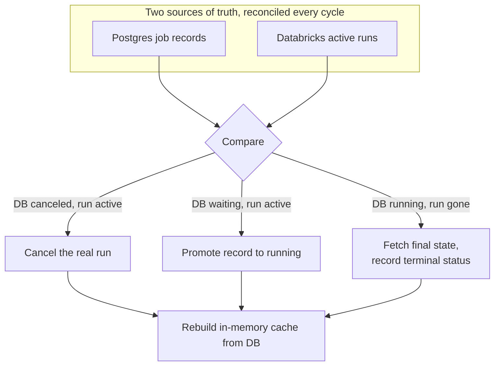

The payoff is that a redeploy mid-flight is a non-event. The app can be torn down with ten
runs in flight, come back a minute later with an empty memory, read the database, rescan
Databricks, and pick the reconciliation up exactly where it left off. Nothing is lost
because nothing important was ever only in memory. This is the same lesson from the first
article in a different outfit: write the state down where it survives the process, and treat
every startup as a recovery.

## Cluster policies are the real configuration

Now the part we underestimated completely. We assumed the interesting configuration of a run
was things like worker count and runtime version, and that cluster policies were an
administrative detail. It is the other way around. The cluster policy is where the real
configuration lives, and the queue config just points at it.

A cluster policy is a workspace object, owned by the platform team, that constrains and
pre-fills what a cluster is allowed to look like. It can fix a value outright ("single node,
no argument") or supply a default that can be overridden. It can pin the runtime, pin the
node family, force a security mode, attach governance tags. The queue configuration for a
given queue mostly just names a policy and an instance pool, and lets the policy do the
heavy lifting.

This separation turned out to be exactly the right seam. The platform team changes what
hardware runs look like by editing a policy, with no redeploy of the app and no change to
the queue config. The app's job is not to decide what a cluster should be; it is to read the
policy the platform team already defined, turn its constraints into an actual cluster spec,
and respect them.

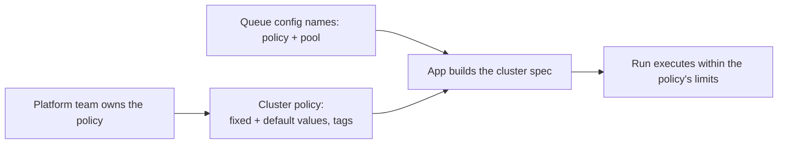

Reading a policy is slightly fiddly because it comes back as a definition where each field is
a constraint with a type. The app walks it: a fixed constraint becomes a value the run must
use, a constraint with a default becomes a value the run uses unless something overrides it,
and a special family of entries that start with a tag prefix are pulled out and turned into
cluster tags. Everything else is ignored. We only lift the handful of keys that actually shape
a cluster, runtime, worker counts, pool references, the single-node flag, and leave the rest
of the policy's concerns to Databricks to enforce.

## The three-layer cluster spec

Building the spec for a run is a layered merge, and the order matters because later layers
win. Getting this order wrong produces clusters that either violate the policy or ignore the
user, so it is worth being explicit.

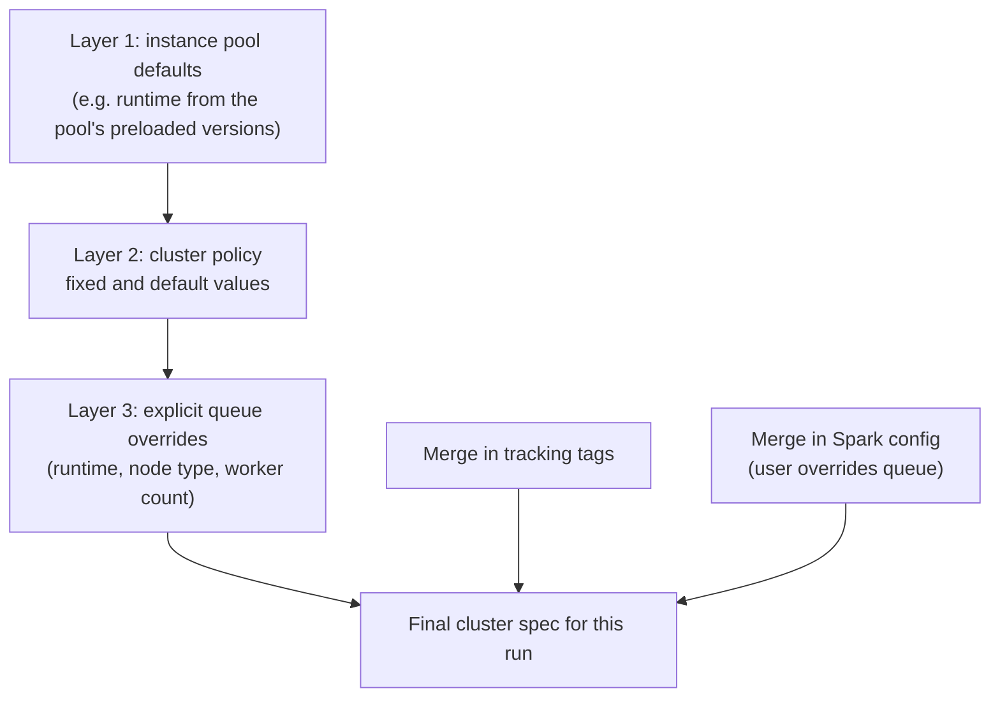

Layer one is the instance pool, if the queue names one: it contributes sensible defaults like
a runtime version drawn from what the pool has preloaded. Layer two is the policy, which
lays its fixed and default values on top. Layer three is the small set of explicit overrides
a queue is allowed to state directly. Then two more things get folded in: the tracking tags
that let us find the run later, and the Spark configuration, where a user-supplied value is
allowed to override a queue-level default. There is even a small escape hatch where a special
Spark config key can set the worker count, which is handy when a notebook genuinely needs to
size its own cluster.

The lesson of the layering is that nobody owns the whole spec. The pool owns some defaults,
the platform team owns the constraints through the policy, the queue owns a few explicit
knobs, and the user owns a narrow slice of Spark config. The app's job is just to merge them
in an order that respects who should win.

## Pools, and the rules you only learn by breaking them

Instance pools are where we collected the most scar tissue, because the API has rules it does
not tell you about until you violate them.

The big one: Databricks rejects a cluster spec that names both an instance pool and a node
type. The pool already decides the node type, so specifying one is a contradiction, and the
error you get does not say "you can't set both," it says something more oblique. So the spec
builder has a hard rule: the moment any pool is referenced, anywhere in the merged spec,
including a pool that came in through the policy rather than the queue config, it strips the
node type fields out entirely. That single rule removed a whole category of intermittent
submission failures that only showed up for certain queues.

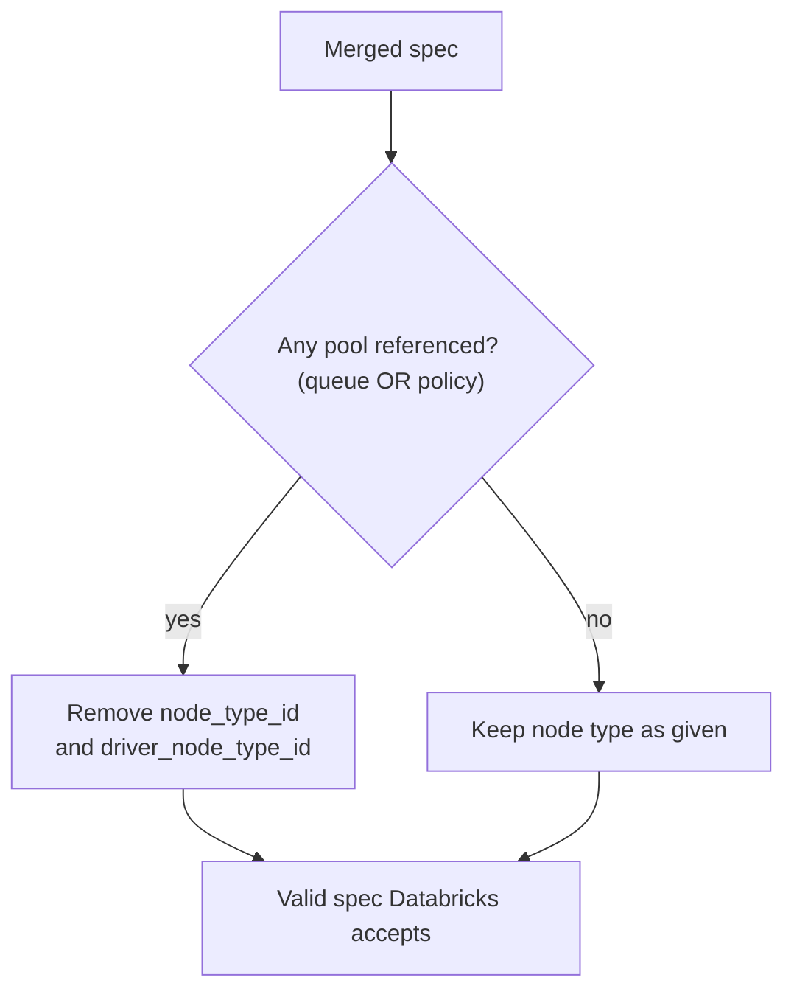

The other one is single-node clusters. If a policy fixes the single-node flag on, that is not
just "zero workers," it is a different kind of cluster that needs a specific cluster kind and
a specific security mode set, or the submission is rejected. So when the builder sees that
flag come out of the policy, it also sets those two companion fields. Again, this is a rule we
learned by having a perfectly reasonable-looking single-node policy refuse to launch, with an
error that named the security mode rather than the actual cause.

## When the pool is full

A pool running out of capacity is not an error in the normal sense. It is a "come back in a
minute." But the Databricks API reports it the same way it reports a real failure, as a
rejection at run time, so the app has to tell the two apart.

The queue does this by pattern-matching the specific capacity signals (the pool being at max,
no available nodes) and treating only those as transient. A transient capacity rejection
leaves the job exactly where it was, waiting, so the next monitor cycle simply tries to
promote it again. Any other submission error is treated as permanent: the job moves to
failed with the error recorded, and it is not retried, because retrying a genuine
misconfiguration forever is just a way to hide a bug.

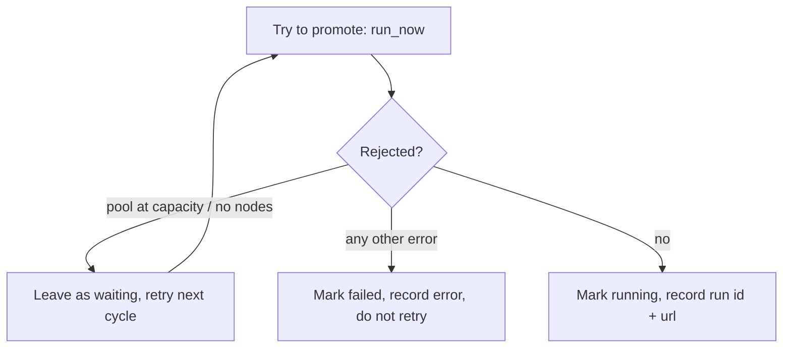

This distinction, transient versus permanent, is the kind of thing that looks like a detail
and turns out to define how the system feels to operate. Get it wrong in one direction and a
busy pool produces a storm of spurious failures users have to resubmit by hand. Get it wrong
in the other and a real bug retries silently forever and never surfaces. The queue only
needs to retry the one thing that is genuinely worth retrying.

## Tagging everything so you can find it later

The last piece that pulls it all together is tags, and they are quietly load-bearing. Every
cluster a run launches is stamped with a set of tracking tags: the internal job id, the
parent queue, the subqueue, the submitting user, the tenant, the folder, and a flag for
whether it ran in the primary or the secondary workspace.

They exist so the app can always find its own work. If the database were ever lost, the runs
themselves still carry enough identity in their tags to be rediscovered and reconciled. They
make the reconciliation loop possible, they make the governance side legible (because the
tags also flow through to the policy's own tags), and they make a messy multi-tenant workspace
searchable instead of being a soup of anonymous clusters. Tagging at creation time, once, is
the cheapest insurance in the whole system.

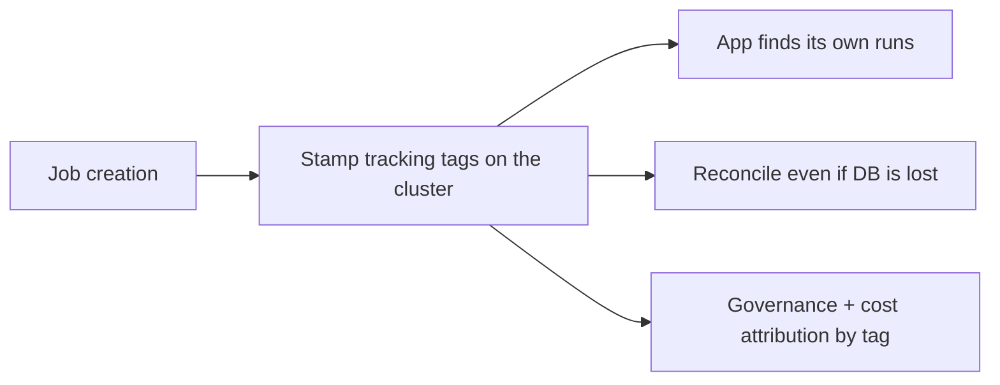

## What we keep wishing for, part two

If the first article's wish was a cross-app auth story, this one's wish is smaller and more
specific: we would love a first-class notion of "a run the user asked for, rate-limited,
owned by them, that we can watch." We built that out of persistent jobs, a background thread, a
Postgres table, and a reconciliation loop, and it works well, but it is a lot of machinery to
express an idea that feels like it should be primitive. A managed queue that understood
per-identity fairness and owned-by-the-user execution, and that survived our process
restarting, would delete the second most complicated piece of the system after the auth
bounce.

But as before, this is not really a complaint. Persistent jobs gave us durable ownership and
access control for free. Cluster policies gave us a clean seam between what the app decides
and what the platform team controls. The in-process queue gave us something we can actually
reason about at three in the morning. The seams were, again, exactly where the interesting
work was.
